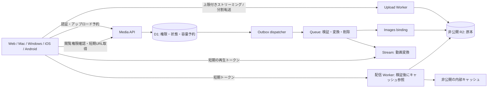

# 添付ファイル・動画配信の設計

作成日: 2026-10-02 / 調査対象: main `5ba06e3`。
状態: 実装に進める設計。以下の新API・基盤・上限・SLOは提案値であり、導入済み・負荷検証済みではない。

## 決定

**原本は非公開R2、権限とメタデータはD1、画像派生物はImages binding、動画の再生用データはStream。アプリは共通のasset IDで参照する。**

最適化する対象は「会話内で迷わず開ける」「回線が弱くても再開できる」「他のワークスペースに漏れない」「投稿量に応じて費用を制御できる」の4点。利用実績が不明なため、無制限アップロードや先行したDB分割は採用しない。既存の25 MiB/件・10件/メッセージを当面維持する。

アップロードはまず**サイズを検証するストリーミングゲートウェイ**を採用する。R2への署名付き直送は将来の選択肢に残すが、単にURLを渡すだけではサイズ上限・再送・上書きの統制が不足するため、初期構成の必須条件にはしない。



Stream/Images/Queueは契約・binding・費用を確認して実装段階で有効化する。この設計書を保存しただけで課金サービスや本番設定は変更しない。

## 1. 現状と不足

| 経路 | 確認できた現状 | 変更方針 |
|---|---|---|
| チャット `worker/src/files.js` | 25 MiB上限。R2原本、D1 `message_files`。署名URLは約24〜48時間有効 | 新規は共通assetモデルと5分トークンへ |
| チャット取得 | Range/206対応。取得ごとにD1行を読む。ブラウザ向けprivateキャッシュ | 認可APIとバイト配信を分離 |
| カード動画 `worker/src/media.js` | 12 MiB上限。UUIDのR2オブジェクト。GETはセッション・期限検証なし。public/1年。Range処理なし | 最優先で所有権・参照先を付けて統合 |
| アップロード | `readCapped`が全チャンクを保持し、さらに結合バッファを確保 | 全量バッファを廃止。転送量を逐次検証 |
| 削除 | R2削除失敗を握りつぶしてメタデータ削除へ進む経路あり | 論理削除→再試行可能な物理削除 |
| 画像 | 一覧でも原本を取得。HEIC等の端末差あり | 固定サイズの派生画像を用意 |
| iPhone | PR #190でアプリ内プレビューへ変更。アップロードAPIはData引数 | プレビューを維持し、転送はファイルURLから行う |
| Web/デスクトップ | 画像ライトボックス・動画インライン再生あり | 共通manifestを使い、未対応形式も画面内にエラー表示 |

コードの「R2は保存だけが課金対象」というコメントは誤り。保存量に加えて操作数も課金対象。旧カード動画はURLがランダムでもアクセス認可の代わりにはならない。[R2料金](https://developers.cloudflare.com/r2/pricing/)

## 2. 共通データモデル

原本を参照するIDを永続化し、署名URLは保存しない。

| テーブル | 主なフィールド・制約 |
|---|---|
| `media_assets` | `id, org_id, uploader, detected_type, original_name, byte_size, width, height, duration_ms, original_key, content_version, state, created_at, deleted_at` |
| `media_refs` | `org_id, asset_id, parent_kind(message/card), parent_id, channel`。参照先とassetのorg一致必須。参照追加時に毎回認可 |
| `media_variants` | `asset_id, content_version, variant, provider, object_key/provider_id, state, byte_size`。組をUNIQUEにする |
| `media_uploads` | `id, asset_id, org_id, uploader, scope, expected_bytes, reserved_bytes, expires_at, state, multipart_id, idempotency_key` |
| `media_upload_parts` | `upload_id, part_number, expected_bytes, etag, state`。同一partの再送を冪等にする |
| `media_usage` | org単位の`used_bytes, reserved_bytes, video_minutes, period`。容量予約は条件付き更新で競合防止 |
| `media_outbox` | `event_id, asset_id, version, job_kind, dispatched_at, attempts`。状態更新と同一DB batchで書く |

索引: `(org_id,id)`、refsの`(org_id,parent_kind,parent_id)`、uploadsの`(state,expires_at)`、jobsの`(dispatched_at,created_at)`。既存の`message_files`は移行中の互換投影とし、二つのテーブルを独立した正として運用しない。

状態は混ぜない。

- upload: `reserved → uploading → uploaded → verifying → completed`。失敗/期限切れは`failed/expired`へ。
- asset: `quarantined → ready → deleting → deleted`。検証NGは`rejected`へ。
- variant: `pending → processing → ready/failed`。原本readyでも動画の変換中は再生準備中になり得る。
- メッセージとの関連付けはasset状態とは別。投稿を先に確定できるが、検証前の原本は誰にも配信しない。
- 同じ原本を複数投稿で参照する場合、1投稿の削除で他の正当な参照を消さない。最後の参照が消えた時点で削除対象にする。orgをまたいだ重複排除は行わない。

## 3. アップロード

1. `POST /v2/media/uploads` に親の種類・scope・ファイル名・申告MIME・サイズ・冪等キーを渡す。
2. サーバーがログイン、組織所属、対象会話への投稿権限、個数、サイズ、容量残枠を確認。orgは認証コンテキストから決める。容量の条件付き予約とupload作成を原子的に行う。org/ユーザー/IP単位の予約・転送レート制限を設け、同じ冪等キーを別のサイズやscopeで再利用した場合は409で拒否する。
3. 5 MiB以下はsingle、超える場合は5 MiBのpart（最後だけ小さくてよい）を推奨。part数・各サイズ・R2キーはサーバーが固定する。クライアントの同時転送は最大2、同時予約はユーザーあたり4を初期値とする。
4. 各PUTは認証済みuploadセッションを確認し、期待サイズの`FixedLengthStream`でR2へ渡す。過不足・切断で両側をabortし、成功扱いにしない。producer/consumerを並行開始してbackpressureを保つ。片側失敗時は両側のPromiseを回収する。
5. completeでサーバーが記録したpart一覧から組み立て、R2 HEADの実サイズを照合。MIMEはContent-Typeだけを信用せず、署名・実形式・寸法・展開量を検証する。
6. 検証・派生処理をoutboxからQueueへ送り、完了結果を通知する。completeの再送は同じasset IDを返す。ETagをファイル全体のSHA-256とはみなさない。
7. 予約の期限切れ、途中離脱、未投稿を回収。multipart abortと容量解放を再試行する。R2成功/D1失敗を照合ジョブで回復する。

リクエストヘッダーのContent-Lengthは早期拒否に使えるが、実際の転送サイズ検証を省略しない。ブラウザがContent-Lengthを設定できることを前提にせず、予約した期待バイト数を使う。旧APIの長さ不明bodyは固定上限のpartバッファで取り込み、全量結合はしない。移行中も既存上限を維持する。

Workersのメモリ制限はリクエスト単位ではなくisolate単位の128 MBであり、25 MiBを全量保持する実装は同時処理で不利になる。FixedLengthStreamは過不足をエラーにするが、R2へのキャンセル伝播を含めてstagingで検証する。[Workers制限](https://developers.cloudflare.com/workers/platform/limits/#memory)、[FixedLengthStream](https://developers.cloudflare.com/workers/runtime-apis/streams/transformstream/#fixedlengthstream)

署名付きR2直送を後から有効化する場合は、隔離prefixへの固定part・短い期限・署名対象ヘッダー・実サイズ検証・再利用/上書き防止を先にテストする。署名URLは期限内に再利用可能であり、単発使用券ではない。厳密な上限を直送で保証できないクライアントはゲートウェイ経由を維持する。[R2署名URL](https://developers.cloudflare.com/r2/api/s3/presigned-urls/)

## 4. 検証・派生物

- **画像:** 最長辺320/960/1920pxの固定variant。縦横比を保持し、原本以上には拡大しない。表示用はEXIF位置情報等を除去。JPEG/WebPを基本とし、アルファ保持が必要な画像は対応形式にする。派生キーに変換仕様versionとformatを含める。任意のwidthパラメーターで無制限に変換させない。
- **HEIC/アニメーション:** bindingの対応を実ファイルで検証。変換不能な原本をWebで表示できると扱わず、未対応表示＋明示的保存にする。アニメーションは静止サムネイルと原本表示を分ける。
- **動画:** 新規動画の再生variantはStreamで作成し、HLS＋ポスターをmanifestに載せる。変換は投稿API内で待たない。Stream側は常に署名必須にし、サムネイル・ダウンロード・埋め込みも未認証公開にしない。R2原本は元ファイル保存用に保持するため二重保存費を計上する。
- **Stream取り込み:** 検証済みR2原本を、処理用の専用短期URLで取得させる。ユーザーのセッショントークンは渡さない。期限・asset・用途を固定し、ログから署名を除去する。期限不足のジョブは新URLで有限回再試行する。
- **音声:** 対応codecならRange再生。変換が必要な音声をStream動画処理へ暗黙に流用しない。初期は対応形式を明示し、非対応時は画面内表示と保存を提供。必要が実測された時点で音声変換workerを追加する。
- **文書:** iOSはQuick Look、Webは対応PDFなどを隔離したビューアで表示。HTML/SVG/アーカイブは実行しない。未対応形式は説明と保存操作。原本配信は別メディアorigin、`nosniff`、適切なContent-Dispositionを使用する。
- 原本を軽量な検査だけで「ウイルス検査済み」と表示しない。危険形式はダウンロードのみ。完全な文書スキャンが必要な組織では検査完了まで隔離するポリシーを追加する。

Images bindingはR2のstreamから変換できるため、変換のために原本を公開する必要はない。Streamの署名付き再生を採用する。[Images binding](https://developers.cloudflare.com/images/optimization/binding/)、[Streamの保護](https://developers.cloudflare.com/stream/viewing-videos/securing-your-stream/)

## 5. 閲覧権限・キャッシュ

`POST /v2/media/access`で表示対象のasset IDを最大30件まとめて渡す。D1の現在の権限と参照先を検証し、許可されたものだけ5分有効のURLを返す。権限確認は最新状態を参照する経路を使い、古いread replicaやキャッシュにより失効後もURLを新規発行し続けないようにする。閲覧ログやレスポンスに他組織の存在を漏らさない。レスポンスは`no-store`。

トークンは`kid, asset_id, org_id, content_version, variant, disposition, exp, audience`を署名対象にする。配信Workerは署名・期限・許可variant・用途を**キャッシュ参照前**に検証。署名鍵はSecretsに置き、kidでローテーションする。ユーザーに任意のR2キーを指定させない。

**採用する失効保証:** 権限変更後は新しいURLを発行しない。発行済みURLによる新規取得は最大5分残り得る。すでに取得済みのファイルやプレーヤーバッファは回収できない。退会・削除直後に全端末から即座に消えるとは約束しない。5分が許されない契約では、別途毎回認可する厳格モードが必要になる。

配信Workerはトークンの検証とR2/キャッシュの取得を担当し、通常のRangeごとにD1を読まない。URLはbearer capabilityなので、その5分間に他人へコピーされた場合も取得可能。Referer制限やCORSを認可の代わりにしない。

内部キャッシュキーは`org/asset/content_version/variant/format`。署名の違いで原本を複製しない。内部保存レスポンスのTTLと、外へ返す`Cache-Control: private`を分ける。クライアントTTLは残りトークン寿命以下。Service Workerにも永続保存させない。内部キャッシュURLは外部ルートとして配信しない。

初期のedgeキャッシュ対象は小さな画像派生物だけ。原本RangeはR2からstream、動画のセグメントはStreamに任せる。206レスポンスをそのままCache APIにputしない。Cache APIはデータセンター単位であり、グローバル共有・全拠点一括削除を仮定しない。[Cache API](https://developers.cloudflare.com/workers/runtime-apis/cache/)

`HEAD, GET, Range, If-Range, ETag, 200/206/304/416`の契約を統一する。期限切れと権限不足はクライアントが判別できる内部エラーコードを返し、外部向けには存在を推測させない。署名をqueryに載せる経路ではアクセスログ・分析・クラッシュレポートから除去し、Referrer-Policyを設定する。

## 6. 共通APIとクライアント

| API | 成功時の意味 |
|---|---|
| `POST /v2/media/uploads` | 201: 予約できた。ファイル保存・公開完了ではない |
| `PUT /v2/media/uploads/:id/body` / `parts/:n` | 204: 指定バイトの保存完了 |
| `POST /v2/media/uploads/:id/complete` | 202: 検証/派生処理中、200: 冪等な完了済み結果 |
| `GET /v2/media/:id` | 権限確認済みmanifest。状態・variant・エラーを返す |
| `POST /v2/media/access` | 閲覧可能な短期URL群。長期保存禁止 |
| `DELETE /v2/media/uploads/:id` | 202: 中止を受理。容量解放・削除の最終状態は別途確認 |

manifest例（`urls`はaccess APIで都度取得）:

```json
{
  "id": "asset_opaque_id", "version": 1, "kind": "video",
  "name": "demo.mov", "bytes": 12000000,
  "state": "ready", "width": 1920, "height": 1080,
  "variants": {
    "poster": {"state": "ready", "format": "jpeg"},
    "playback": {"state": "processing", "format": "hls"},
    "original": {"state": "ready", "downloadOnly": true}
  }
}
```

- 全プラットフォームでタップはビューアを開く。外部ブラウザへのフォールバックは禁止。保存・共有は別の明示操作。
- 一覧は320/960pxと遅延読み込み。ビューアで1920px、原本は明示的に要求する。動画一覧はポスターのみ、再生開始時にmanifestを読む。自動再生はしない。
- 再生URLは期限60秒前に、前面で再生中の場合だけ更新する。時刻・音量・一時停止を保持し、更新時の再バッファを実機試験する。401/期限切れは再認可を1回だけ試し、403を無限リトライしない。
- アップロードはキャンセル・進捗・再送を表示し、送信済みpartを再利用する。iOS/Androidはローカルファイルから転送し、巨大なData/base64を保持しない。
- 画面離脱時は再生停止。ログアウト/組織切り替えでmanifestと一時ファイルを破棄。アプリ終了で残った一時ファイルも次回起動時に清掃する。
- Androidにも同じAPI契約を使う。既存モバイルのデータモデルと本番チャットが一致するかを確認してから組み込み、別ストアへ添付だけ二重書き込みしない。

## 7. ジョブ・削除・障害

Queueは重複配信を前提に、`asset_id + content_version + job_kind`で冪等化。DBの状態変更とoutbox保存を同一batchに含め、送信失敗はdispatcherが回収する。webhookは署名を検証し、古いversionや削除済みassetを復活させない。重い独自動画変換を通常Worker内で行わない。

削除は参照/権限を即座に無効化し、以後access APIで発行しない。R2原本・派生物・Stream・関連ジョブを非同期で削除し、完了までtombstoneを残す。失敗は有限回の自動再試行→DLQとアラートへ。古いtokenの最大5分、既に取得済みデータの限界を区別する。

初期運用値: upload予約1時間、未投稿asset24時間、未完multipart24時間で回収。法的保持/組織の保存ポリシー対象は通常清掃から除外する。削除・失敗・課金枠解放はat-least-onceでも二重減算しない。R2とDBの孤立オブジェクトを定期照合する。

変換障害でもメッセージ本文は読める。再生variantがfailedならアプリ内で再試行/保存を示す。検証済み・端末互換の原本だけを明示的に再生可能なfallbackとし、検証前データを迂回公開しない。

## 8. コストと容量

月額を「原本GB-month＋派生GB-month＋R2操作数＋Workers/Queues/D1＋画像変換数＋Stream保存分数/配信分数」で見る。R2の帯域無料を動画配信全体の無料と混同しない。料金は見積もり実行時に取得する。[R2料金](https://developers.cloudflare.com/r2/pricing/)、[Stream料金](https://developers.cloudflare.com/stream/pricing/)

org別に保存容量、予約容量、アップロード量、再生分数、変換数を集計。プラン上限は設定テーブルから取得し、UI・API・予約処理で共有する。課金額の不明な無制限枠をコードに埋め込まない。80%で通知、100%で新規アップロードを止め、既存閲覧・削除は可能にする。動画は実時間判明後に予約を精算する。

画像variantは必要な3種類に限定し、何度アクセスしても再変換しない。原本の重複アップロード防止は同じorg/同じupload再送を優先し、全社横断のハッシュ照合は導入しない。

予算未指定なので「月額いくらで済む」「何万人まで保証」とは断定しない。容量枠とStreamの予算アラートを設定し、変換を有効にする組織を段階的に増やす。

## 9. 段階移行と戻し方

| 段階 | 変更 | 完了条件 |
|---|---|---|
| 1 | 共通asset/refs/予約/outboxとアップロードのバッファ廃止。旧APIアダプター | 現行Web/iOSの投稿が成功し、サイズ超過・切断で公開されない |
| 2 | access API・クライアント更新・旧カード動画の配信統合 | 全参照のorg/親が確定、未認証GET停止、Range互換と権限テスト合格 |
| 3 | 画像variant・共通manifest | 一覧が原本を読まず、全OSで画面内表示 |
| 4 | Stream変換・署名再生・モバイルの更新/再開 | 対応端末のcodec/回線試験と費用計測合格 |
| 5 | 負荷試験後に上限/対象組織を拡張 | 下記SLOを満たす。必要時のみDBのorg単位分割を判断 |

旧カード動画の調査・所有権対応表作成は段階1から開始する。チャットの`file-*`と`org/.../files/...`は読み取り互換を残し、原本を一括コピーしない。新しい派生物だけ新namespaceへ書く。

旧カードの`videoURL`からUUIDを抽出し、実際のcard/イベント履歴のorg・親と照合する。所属が不明・複数orgに矛盾するものは自動公開しない。メッセージ/カードのREST・WebSocket・検索・履歴全経路で新URLをhydrateする。既存の会話認可ロジックを再利用する。

旧`/media/:uuid`の匿名アクセスと即時失効は両立しない。新クライアントとURL hydrationを展開し、旧クライアントには更新導線を出してから匿名配信を廃止する。旧URLへのpublic/1年キャッシュは、CDN側をpurgeしても端末へ取得済みの内容を消せない。この移行期間だけは新経路の5分保証の対象外として追跡する。

機能フラグは`upload_v2 / image_variants / stream_playback / media_access_v2`。新経路の不具合では新規処理だけ止め、認可済み原本へのfallbackを使う。保護済み動画を匿名公開へ戻さない。破壊的な旧列削除は旧クライアントと参照の使用率がゼロになるまで実施しない。

## 10. リリース判定

以下はstagingの合格目標であり、実測結果ではない。負荷データは専用orgへ作り、実ユーザーデータを使わない。

- 50同時アップロード×25 MiBを15分。切断・再送・サイズ偽装を混ぜ、超過保存/重複課金/未検証公開が0。Workerのメモリがファイル全体サイズに比例して増加しないことを計測する。
- 500同時閲覧を15分。画像一覧/動画/Rangeを混在させ、5xx率0.1%未満。APIの権限確認p95 300ms以下、warm画像のTTFB p95 300ms以下を対象地域で測る。実際の回線別の描画/再生時間とは区別する。
- 制御した10Mbps/RTT100msで、既に処理済み動画のタップ→最初のフレームp95 2秒以下を目標。失速率・再バッファ回数も記録する。
- 他org、private channel離脱、DM部外者、偽造token、期限切れ、variant改ざん、削除、クォータ競合、multipart再利用をテスト。発行済みtokenの新規取得が5分を超えて許可されない。
- iPhone実機/Safari、Android実機/Chrome、Mac、Windows/EdgeでPNG/JPEG/HEIC/GIF、MP4/MOV/WebM、音声、PDF、破損ファイルを確認。正常系だけでなく低速回線・バックグラウンド復帰・長時間再生中のURL更新を含める。
- Queue重複/遅延、Stream webhook重複・順序逆転、R2成功後のDB失敗、削除失敗、ジョブDLQを注入し、孤立オブジェクトが照合で回収されることを確認。
- 監視指標: upload成功率、p95時間、予約残留、キュー最古ジョブ、変換失敗率、cache hit率、R2/D1呼び出し数、再生開始時間、org別原価。閾値超過時は新規展開を止める。

最初の実装単位は段階1。ステージングの結果と実トラフィックから次の範囲を決める。設計書の完成と、基盤の実装・本番移行・性能保証は別の完了条件とする。
