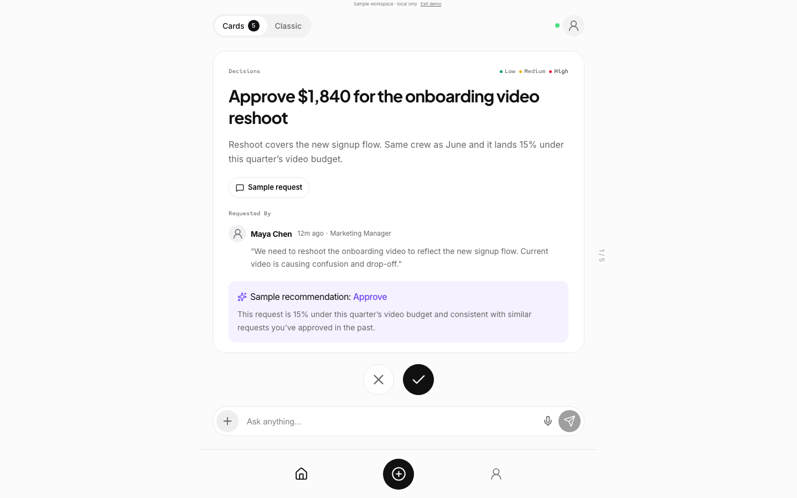

# Desktop layout follow-up — 2026-09-08

The PC layout follows the existing HonmaruAI Figma mobile composition while adapting its width and typography for a desktop. No Figma desktop frame was supplied or invented. The prior mobile source and implementation comparison is recorded in [the Figma review](../../figma-alignment/2026-09-08/README.md).

## Observed problem and correction

Both the authenticated `/?view=inbox` and sample `/?demo=figma` routes were inspected in the in-app browser. Their outer 520px columns were mathematically centered, but the desktop summary still stopped at 285px, leaving an unbalanced empty area on the right. Profile used a different 430px width. At 1280×720, the composer ended at y637 while navigation started at y632: a 5px overlap.

The shared frame is now 720px from a 900px viewport, with 24px content gutters. Desktop summaries use the full card width, headings are 30px and body text is 16px. Card, actions, composer, header, Classic and Profile have the same horizontal center. Cards can scroll internally on short screens while decisions and the composer remain visible. Navigation reservation includes an additional 24px desktop / 12px mobile gap. The 390×844 Figma composition retains its original dimensions.

Desktop dialogs open in the center of the workspace. Profile closes before opening the composer, fixing a case where the dialog appeared behind the Profile screen. Classic masks scrolling rows underneath its fixed mode selector and blocks clicks through that area. The desktop Welcome introduction and entry buttons stay together in a centered stack.

## Visual evidence

| View | Capture |
| --- | --- |
| Small PC / short laptop | [1024×768](1024x768-feed.png), [1280×720](1280x720-feed.png) |
| Large PC | [1920×1080](1920x1080-feed.png) |
| Classic / Profile | [Classic](1440x900-classic.png), [Profile](1440x900-profile.png) |
| Centered preview / Welcome | [Preview at 1280×720](1280x720-compose-preview.png), [Welcome](1280x720-welcome.png) |
| Mobile preserved / short mobile | [390×844](390x844-feed.png), [320×640](320x640-feed.png) |
| Initial in-app observation | [Before at 1280×720, Japanese/dark](before-1280.png) |

Final captures above use the isolated English/light sample at density 1. The initial image is a Japanese/dark observation and is not a pixel-difference comparison with the English/light captures. The in-app review also inspected Japanese/dark authenticated requests, sample Cards, Classic, Profile and Profile-to-compose. The current 390×844 capture and original Figma source were visually inspected together; portraits/source data and device chrome remain the previously documented product/platform adaptations.

## Verification

- Production frontend build and 23 web unit tests passed.
- Cold production bundle with a fresh disposable local Worker/D1/R2: all 12 workflow groups passed, including real recipient selection, sending, approval/undo, reply/history, reload, account switching and Profile-to-compose.
- The same cold production preview passed **36 layout checks**: Welcome, Feed, Profile, Classic, compose and preview at 1024×768, 1280×720, 1440×900, 1920×1080, 390×844 and 320×640.
- The gate checks horizontal centers, no horizontal text overflow, card/action/composer ordering, at least 8px composer/navigation clearance, visible dialog actions and desktop dialog centering. No runtime errors or unexpected network requests were observed. [Measured results](checks.json).
- `web-react/scripts/ci-browser-smoke.sh` now runs `check-desktop-layout.mjs` against its disposable production frontend; CI uploads the full capture set in its existing browser artifact. Selected captures are committed here.

This is verified local web behavior. It does not establish production deployment, physical-device/native release readiness, external provider behavior, or user design acceptance. Native source was not changed in this desktop follow-up.
